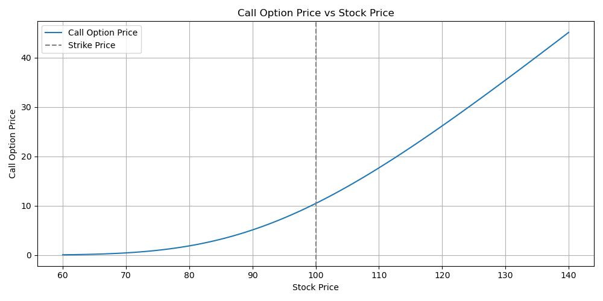

# options-pricing-black-scholes
Python implementation of Black-Scholes model for European option pricing
 Black-Scholes Option Pricing Model

This project implements the Black-Scholes model to price European call and put options using Python.  
It also explores how the option prices change with different input variables (stock price, time to maturity, volatility, interest rate).

The Black-Scholes model is a foundational concept in derivatives pricing, and understanding it is critical for any aspiring quant, trader, or financial engineer.

---

## 🧠 Key Learnings

- Understand the intuition behind the Black-Scholes formula
- Calculate theoretical prices for European call and put options
- Explore the impact of volatility and time on option pricing
- Plot option price sensitivities (Greeks) with respect to inputs
- Use Python libraries like `NumPy`, `SciPy`, and `Matplotlib` for financial modelling

---

## 📈 Output

The notebook includes:

- Call and put option price calculations
- Sensitivity charts showing how prices vary with time, volatility, and moneyness
- Visual demonstrations of convexity, time decay, and Vega



---

## 🛠️ Tools Used

- Python
- NumPy
- SciPy (for the normal distribution)
- Matplotlib

---

## ▶️ How to Run

To run this notebook:

1. Clone the repository or download the ZIP
2. Open the `.ipynb` file in Jupyter Notebook or VS Code
3. Make sure the following libraries are installed:

```bash
pip install numpy scipy matplotlib